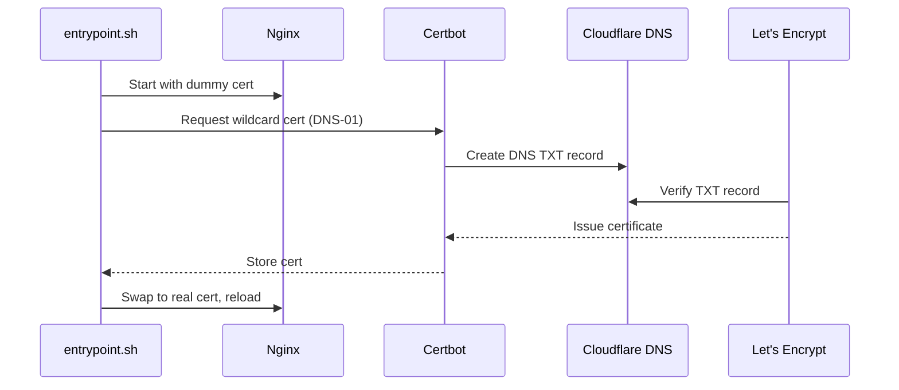

# HTTPS-Ready Nginx Docker (DNS-01)

Nginx container that gets a wildcard certificate from Let's Encrypt through the Cloudflare DNS-01 challenge. One certificate covers the apex domain and `*.your-domain`, so the main site and every subdomain share it. Validation runs over DNS, not port 80, so this works behind a firewall or with port 80 closed.

On startup the container serves a temporary self-signed cert so Nginx boots right away. Certbot then requests the real wildcard cert through Cloudflare, the container swaps to it, and Nginx reloads. A background job renews it every 12 hours.



## When to use this

Use DNS-01 for a wildcard certificate, or when you cannot expose port 80. It needs a Cloudflare API token that can edit DNS for your zone. For HTTP validation without a wildcard, use `HTTP-01/` instead.

## Prerequisites

- Docker and Docker Compose
- A domain whose DNS is managed by Cloudflare
- A Cloudflare API token with DNS edit permission for that domain

## Setup

1. **Clone and enter the folder**
   ```bash
   git clone <repository-url>
   cd https-ready-nginx-docker/DNS-01
   ```

2. **Create a Cloudflare API token**
   In the Cloudflare dashboard, open My Profile > API Tokens and create a token from the "Edit zone DNS" template, scoped to your domain. Copy it now; Cloudflare won't show it again.

3. **Configure the environment**
   Edit `.env`:
   ```bash
   SSL_DOMAIN=example.com
   SSL_EMAIL=you@example.com
   CLOUDFLARE_API_TOKEN=your-token-here
   ```
   No `SSL_SUBDOMAINS` setting here; the wildcard covers every subdomain.

4. **Configure Nginx**
   - **Main domain:** edit `nginx.conf` and set `server_name` and the `root` path for your frontend.
   - **Subdomains:** add one `.conf` file per subdomain in `subdomains/` (see `subdomains/example-image-gen.conf`). Each must end in `.conf`. No extra certificate steps; the wildcard already covers it.

5. **Run**
   ```bash
   docker-compose up -d
   ```

   The site answers over HTTPS right away. Browsers warn at first because of the self-signed cert; the warning clears once Cloudflare validation finishes and Nginx reloads with the real one, usually within a minute.

## Configuration

| Variable | Description | Required |
|----------|-------------|:--------:|
| `SSL_DOMAIN` | Domain the certificate is issued for. The wildcard `*.SSL_DOMAIN` is added automatically. | Yes |
| `SSL_EMAIL` | Email for Let's Encrypt registration and recovery. | Yes |
| `CLOUDFLARE_API_TOKEN` | Cloudflare token with DNS edit permission, used to answer the DNS-01 challenge. | Yes |

## How renewal works

After the first run, Certbot remembers the DNS-01 settings, so the renewal job runs `certbot renew` every 12 hours and reloads Nginx when a certificate changes. Certificates and the generated Cloudflare credentials file live in the `certbot_conf` volume, so they survive restarts.
