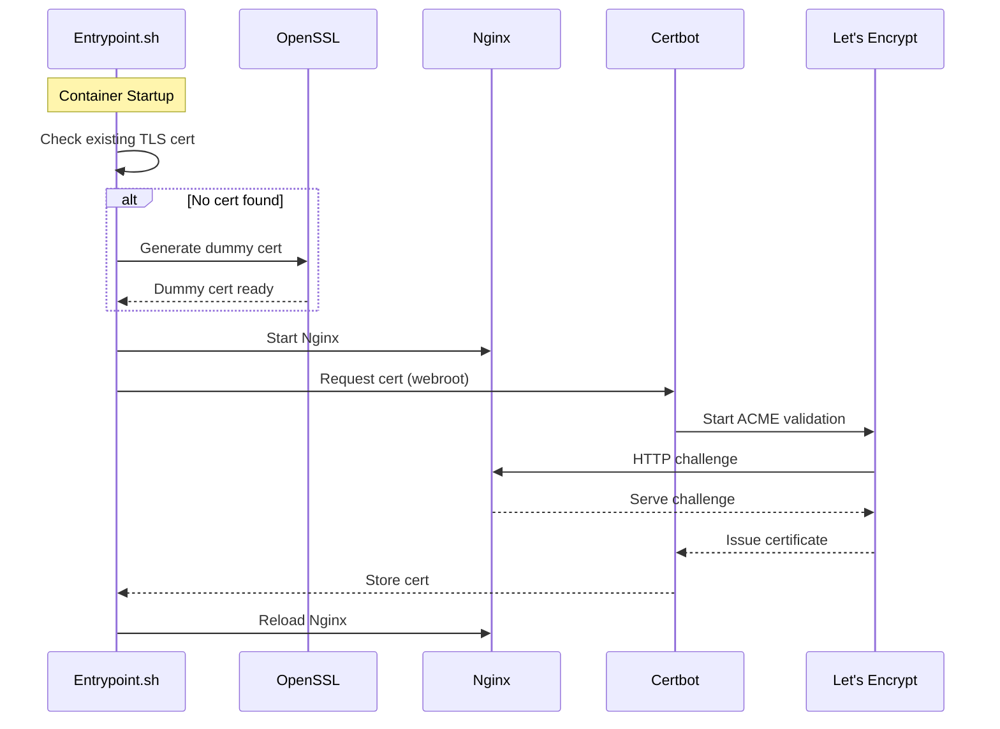

# HTTPS-Ready Nginx Docker

This Nginx based docker automates the process of issueing and renewal of SSL certificates using `certbot` and `letsencrypt`. It works by starting Nginx immediately with a temporary self-signed certificat (`openssl`) then requests a valid certificate from Let's Encrypt.

## Features



- **Default SSL:** Automatically installs Let's Encrypt certificates inside container
- **Auto-Renewal:** Crontab schedule checks for TLS renewals every 12 hours and reloads Nginx automatically.
- **Persistence:** Keeps certificates persistent in Docker Volume
    - `certbot_conf`: Let's Encrypt certificates.
    - `certbot_www`: ACME challenge files.

## Prerequisites

- Docker and Docker Compose
- A running server with public IP

## Quick Start

1. **Clone the repository**
   ```bash
   git clone <repository-url>
   cd https-ready-nginx-docker
   ```

2. **Configure Environment**
   Edit a `.env` file in the root directory:
   ```bash
   DOMAIN=example.com
   # Optional: Comma separated subdomains
   SUBDOMAINS=www,api
   SSL_EMAIL=admin@example.com
   ```

3. **Run**
   ```bash
   docker-compose up -d
   ```

   Your server will be available immediately at `https://example.com`. You may see a browser warning initially (due to the dummy cert), which will disappear once the Let's Encrypt certificate is successfully acquired (usually within a few seconds).

## Configuration

| Variable | Description | Required |
|----------|-------------|:--------:|
| `DOMAIN` | The domain name for the certificate. | Yes |
| `SUBDOMAINS` | Comma-separated list of subdomains (e.g., `www,api`). | No |
| `SSL_EMAIL` | Email address for Let's Encrypt registration and recovery. | Yes |


